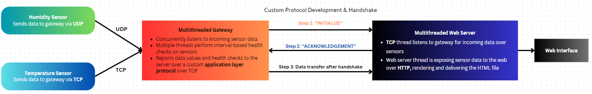

### Multithreaded Gateway-Server Model Development with Application Layer Protocol Design

##### System design flow

##### Summary

In this project, I worked on developing a multithreaded IoT monitoring system with socket programming, worked extensively on UDP and TCP and designed a new protocol structure for connection-oriented data transmission.

Here,

Humidity (uses UDP) and temperature sensors (uses TCP) are tasked with transmitting environmental data measurements to a central gateway periodically. 

As an intermediary, gateway is responsible for receiving the sensor data via TCP and UDP and concurrently performing interval-based health checks at the background. 

Finally, all the data is conveyed to the server over a specifically designed  application layer protocol; and server concurrently exposes these received data over an HTTP web server. 

The system leverages a blend of socket programming, network protocols (TCP, UDP, HTTP, IP...) and multithreading to ensure efficient and accurate data handling.

###### Sensors Functionality
Temperature Sensor: It measures ambient temperature and sends this data periodically (every second) to the gateway via TCP, a reliable, connection-oriented protocol. 
Humidity Sensor: This sensor sends humidity level data every 3 seconds and utilizes UDP for data transmission, offering a faster, albeit less reliable, connectionless communication method. Moreover, every three seconds, humidity sensor generates an “ALIVE” message to the gateway.

###### Gateway
The gateway acts as an intermediary, receiving data from both sensors. It is equipped with multiple threads, each responsible for specific tasks such as listening for incoming data (over concurrent TCP and UDP sockets) and conducting regular health checks (whether if the temperature sensor sent any data over the last 3 seconds, if the humidity sensor sent any data over the last 7 seconds). Finally, gateway uses a handshake-oriented custom protocol over TCP to talk to the server and convey all these information. After processing and repackaging sensor value and health check data, a custom Application Layer protocol is followed before forwarding them to the server.

###### Custom Protocol for Gateway-Server Data Transmission & Handshake
A critical feature of this project is the implementation of a custom Application Layer protocol between the gateway and the server. This protocol dictates a specific format for data transmission, ensuring that the server only accepts data structured in a predefined manner. The protocol is connection-oriented and only after establishing a proper handshake the data can be sent/received.
This custom protocol enhances the system's data integrity and security, allowing precise control over the format and structure of transmitted data.

###### Server
The server, also employing multi-threading, listens for incoming data from the gateway (being equipped to work with the custom application layer protocol) and performs additional processing as needed.
It exposes this data via a web interface, accessible through HTTP endpoints, which present the information in an easily digestible format for end-users.

###### Multi-Threading and Concurrency
The system extensively uses multi-threading across the humidity sensor, gateway, and server to manage concurrent tasks efficiently. This approach allows simultaneous data processing and transmission, health monitoring, and user interface updates.
This concurrent programming strategy is vital for maintaining system responsiveness and reliability, especially in handling real-time data and ensuring continuous operation.
In summary, this project represents a sophisticated combination of sensor technologies, network protocols, custom data formatting, and concurrent programming. It highlights the innovative use of a custom Application Layer protocol to enhance data communication between the gateway and the server, ensuring that the system not only collects accurate environmental data but also transmits it securely and efficiently for real-time monitoring and analysis.
